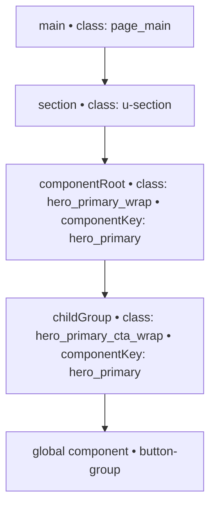
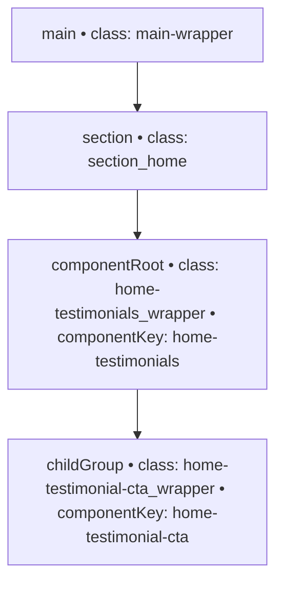

## 1) Purpose

- Give the linter a stable ontology of element roles.
- Keep preset naming in a separate detection layer.
- Enable clear, testable constraints that rules can validate.

---

## 2) Canonical roles and constraints

Each role lists intent, allowed tags, structure, and examples. These are preset agnostic.

### Role: `main`

**Intent:** Singleton node that wraps the primary page content.

- **Allowed tags:** `Main`, or `Div` when legacy markup requires it
- **Singleton:** Yes
- **Parents:** Document body only
- **Expected children:** `section` or `componentRoot`
- **Forbidden descendants:** Global components like Navigation and Footer
- **Code example:**

```html
<main class="page_main">{children}</main>
```

**Examples by preset**

- Lumos: `page_main`
- Client-First: `main-wrapper`

---

### Role: `section`

**Intent:** Page-level block that groups one slice of content.

- **Allowed tags:** `Section`, `Div` when markup is constrained
- **Singleton:** No
- **Parents:** `main`
- **Expected children:** `container`, `layout`, or a `componentRoot`
- **Forbidden parents:** `componentRoot`
- **Code example:**

```html
<section class="section">{children}</section>
```

**Examples by preset**

- Lumos: `u-section`, `section_wrapper`
- Client-First: `section_[id]*`

---

### Role: `componentRoot`

**Intent:** Root wrapper that marks a unique component instance inside a section.

- **Allowed tags:** `Div`
- **Singleton:** No
- **Parents:** `section`
- **Expected children:** `layout`, `content`, or `childGroup`
- **Naming carries:** Component type and variant
- **Code example:**

```html
<div class="hero_primary_wrap">{children}</div>
```

**Examples by preset**

- Lumos: `hero_primary_wrap`, `cta_wrap`
- Client-First: `home-testimonials_wrapper`

---

### Role: `childGroup`

**Intent:** Nested wrapper that groups related parts within a component.

- **Allowed tags:** `Div`, `Link Block`, `Slot`
- **Singleton:** No
- **Parents:** `componentRoot` or another `childGroup`
- **Expected children:** `layout`, `content`, or other `childGroup`
- **Naming carries:** Parent component key and often the sub-part
- **Code example:**

```html
<div class="hero_primary_cta_wrap">{children}</div>
```

**Examples by preset**

- Lumos: `hero_primary_cta_wrap`
- Client-First: `home-testimonial-cta_wrapper`

---

### Roles to stage next

You reference these in constraints, so document them next.

- `container` (width, gutters, margins)
- `layout` (grid, flex, stack)
- `content` (headings, text, links, media)

---

## 3) Detection layer (preset aware)

Detectors convert real nodes into canonical roles using signals. Keep them small, composable, and scored. Multiple detectors can contribute.

**Common approach**

- Use a grammar adapter per preset to parse class naming and extract tokens like `componentKey` and `suffix` such as `wrap` or `wrapper`.
- Give each detector a score from 0 to 1.
- Pick the best scoring role over a threshold.
- Enforce singleton roles after scoring.

### Detection hints by role

**`main`**

- **Primary signals**

  - Tag equals `Main`
  - Class equals common names such as `page_main`, `main-wrapper`

- **Exclusions**

  - If nested under any `componentRoot`, do not classify as `main`

- **Conflict handling**

  - If more than one candidate, keep the highest score and demote others

**`section`**

- **Primary signals**

  - Tag equals `Section`
  - Class contains `u-section`, `section_*`, or `-section-*`

- **Exclusions**

  - If parent is `componentRoot`, treat as `layout` or `content` candidate instead

**`componentRoot`**

- **Primary signals**

  - First custom class ends with `wrap` or `wrapper`
  - An ancestor is a `section` candidate

- **Supplemental**

  - Grammar yields a `componentKey` such as `hero_primary`

- **Exclusions**

  - If no section ancestor, reduce score below threshold

**`childGroup`**

- **Primary signals**

  - Custom class ends with `wrap` or `wrapper`
  - Parsed `componentKey` matches the nearest `componentRoot` ancestor

- **Supplemental**

  - Additional segment indicates sub-part such as `cta`, `footer`, `header`

---

## 4) Rule layer (validation using roles)

Rules consume roles and the element graph. Keep preset details out of rules.

**Core rules**

- **`main`**

  - Exactly one per page
  - Must not contain navigation or footer components
  - Must contain at least one `section` or `componentRoot`

- **`section`**

  - Must be a direct child of `main`
  - First meaningful child should be `container`, `layout`, or a `componentRoot`
  - Must not be nested inside a `componentRoot`

- **`componentRoot`**

  - Must be a descendant of `section`
  - Must contain at least one `layout`, `content`, or `childGroup`
  - Disallow display utilities on the root when a layout child is present

- **`childGroup`**

  - Parent chain must include a `componentRoot` with the same `componentKey`
  - Should not be utility-only unless intentionally declared

---

## 5) Scope and exclusions

Exclude from classification unless the user opts in:

- Global components such as site Navigation, global Footer, cookie banners
- Utility and helper elements used only for designer workflows
- Custom script anchors and non-visual utility nodes

Mark them as `unknown` to keep the graph clean.

---

## 6) Example trees

**Lumos**



**Client-First**



---

## 7) Authoring guidance

- Keep role names canonical: `main`, `section`, `componentRoot`, `childGroup`, `container`, `layout`, `content`.
- Document constraints under the role, not inside detection.
- Write detectors per preset and keep them short.
- Score, threshold, then enforce singletons.
- Turn “Children” prose into rules that assert presence or order.

---

## 8) Test checklist

For each role, write three tests:

1. **Positive**
   Example that should classify to the role.
2. **Negative**
   Similar node with a blocking exclusion that should not classify.
3. **Conflict**
   Two candidates for the same singleton. Highest score wins, others demote to `unknown`.

**Cross-role tests**

- `componentRoot` must not classify outside a section.
- `childGroup` must share `componentKey` with an ancestor root.
- `main` singleton enforcement on pages that contain multiple main-like nodes.
