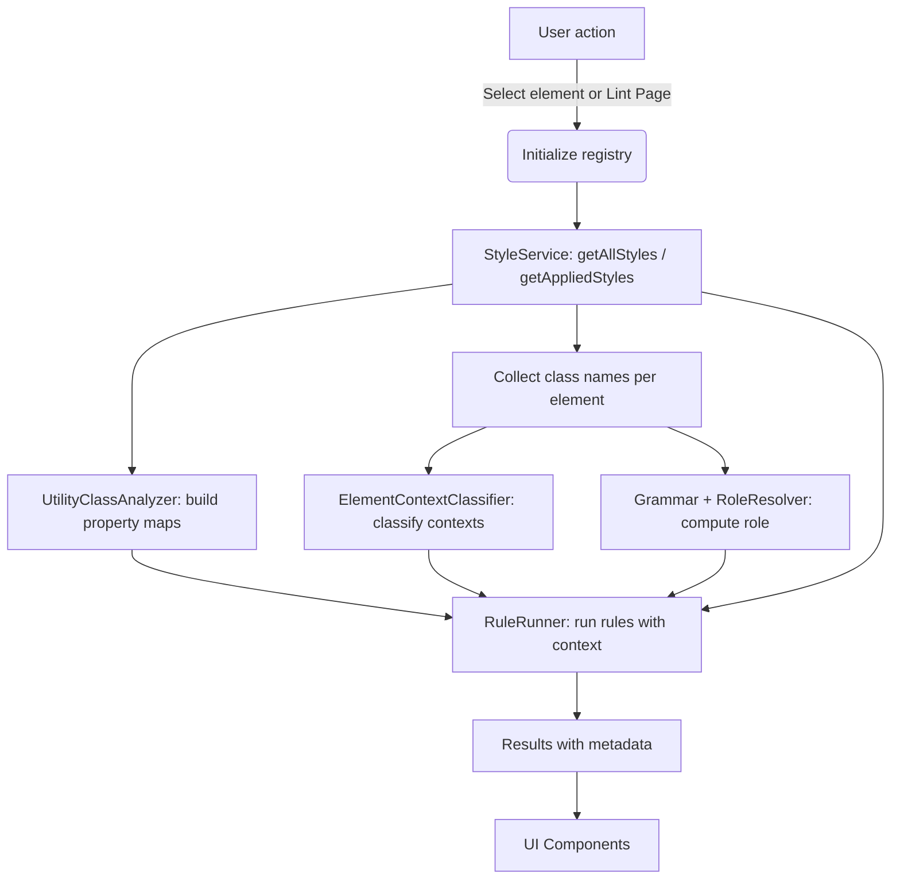

@@

# How It All Works — Webflow Designer Linter

This guide explains the linter end‑to‑end: what happens when you lint a selected element or an entire page, how rules run, how grammar/roles work, how contexts are classified, where configuration and caching live, and how the UI renders results. It reflects the current application state.

## High‑level overview

- The extension runs inside Webflow Designer and exposes a compact UI to lint the selected element or the entire page.
- A shared rule registry is initialized once per session and seeded by a preset (`lumos` or `client-first`) plus persisted configuration.
- Linting gathers styles via the Webflow Designer API, classifies DOM contexts, computes element roles from class names, runs rules, and renders structured results.

## Runtime lifecycles

### Selected element

1. The user selects an element, triggering `useElementLint`.
2. `ensureLinterInitialized()` builds/loads the registry once from the active preset and persisted config.
3. `createElementLintService()`
   - Loads site‑wide styles (cached for the session) and builds utility duplicate maps
   - Retrieves styles applied to the selected element and sorts them
   - Builds or reuses a page‑level parent map and classifies contexts for all elements on the page
   - Parses the first custom class with the preset grammar and maps it to an `ElementRole` via the preset role resolver; reconciles `wrap` with the DOM context
   - Runs `RuleRunner.runRulesOnStylesWithContext`
   - Stamps `metadata.role` per violation when resolvable
4. Hook returns `{ violations, contexts, classNames, roles, isLoading }` to the UI.

### Full page

1. The user clicks “Lint Page” → `usePageLintStore.lintPage()`.
2. `ensureLinterInitialized()` ensures the shared registry is ready.
3. `scanCurrentPageWithMeta(elements)` creates a `PageLintService` with a `RuleRunner` configured for the active preset.
4. Loads all site styles, builds utility maps, extracts class names per element.
5. Classifies DOM contexts, computes per‑element roles, runs rules across all elements.
6. Store updates `results` and `passedClassNames` and flips loading flags for the UI.

## Presets, grammar, and roles

- Presets live under `src/presets/` and define:
  - `id`: preset identifier (`lumos`, `client-first`)
  - `grammar`: `GrammarAdapter` implementation that parses a class name into a structured `ParsedClass`
  - `roles`: `RoleResolver` that maps a `ParsedClass` to an `ElementRole`
  - `rules`: `Rule[]` (naming, property, context‑aware)
  - `contextConfig`: configuration passed to the element‑context classifier

### Grammar basics

- Kind detection: `u-` → `utility`, `is-` → `combo`, `c-` → `component`, otherwise `custom`.
- `lumos.grammar.ts`: underscore `_` tokens; assign `type`, optional `variation`, and `elementToken` as the last token.
- `client-first.grammar.ts`: normalizes `-` to `_` before tokenization to keep role parsing consistent.

### Role resolution

- Resolves the first custom class only (skips `utility`, `combo`, and `component` kinds).
- Common tokens → roles:
  - `wrap` → `componentRoot` (demoted to `childGroup` when not at a root)
  - `contain|container` → `container`
  - `layout` → `layout`
  - `content|title|text|actions|button|link|icon|list|item` → semantic roles
- Client‑first adds awareness of collection classes and wrapper/section patterns.

## DOM context classification

`src/entities/element/model/element-context-classifier.ts`

- Contexts: `componentRoot`, `childGroup`, `childGroupInvalid`.
- Defaults (overridable via `preset.contextConfig`):
  - `wrapSuffix`: `_wrap`
  - `parentClassPatterns`: `"section_contain"`, `/^u-section/`, `/^c-/`, `/^page_main/`
  - `requireDirectParentContainerForRoot`: `true`
  - `childGroupRequiresSharedTypePrefix`: `true`
  - `typePrefixSeparator`: `_`, `typePrefixSegmentIndex`: `0`
  - `groupNamePattern`: `/^[a-z0-9]+(?:_[a-z0-9]+)*$/`, `childGroupPrefixJoiner`: `_`
- Behavior:
  - `componentRoot`: element ends with `_wrap` and its immediate parent matches any container pattern
  - `childGroup`: `_wrap` element nested under a root wrap; when required, its prefix must match the parent’s configured type prefix and group name must pass validation
  - `childGroupInvalid`: nested under a root wrap but prefix/group name validation fails
- Batch method `classifyPageElements` returns an elementId → contexts[] map; caches a parent map keyed by the current element count signature.

## Rule registry and configuration

`src/features/linter/services/registry.ts` and `src/features/linter/model/linter.factory.ts`

- `ensureLinterInitialized(mode = "balanced", preset = currentPreset)`
  - Clears the registry, registers rules from the active preset, applies opinion mode, loads persisted config, merges with schema defaults, updates registry entries.
- `RuleConfigurationService`
  - Persists to `localStorage` under `webflow-linter-rules-config`
  - Merges with each rule’s config schema on load and drops unknown keys
- `RuleRegistry`
  - Stores `Rule` definitions and their `RuleConfiguration`
  - Helpers: get by class type, category, only enabled, export/import config

## Rule execution pipeline

`src/features/linter/services/rule-runner.ts`

1. Build an elementId → styles list and find the base custom class order per element.
2. Element‑level checks (configurable via registry):
   - Utilities before base custom → `lumos-utilities-after-custom-ordering`
   - Combos before base custom → `lumos-combos-after-custom-ordering`
   - Over limit combos (`maxCombos`, default 2) → `lumos-combo-class-limit`
   - Variant requires base → `lumos-variant-requires-base`
3. For each style:
   - Determine `ClassType` via a grammar‑derived resolver; fall back to `u-`/`is-` heuristics
   - Filter rules by class type, enabled state, and targeted context (if any)
   - Execute:
     - Naming rules: prefer `evaluate(name, { config })` else fallback `test(name)`
     - Property rules: analyze `properties` with access to utility duplicate maps and all styles
4. Utility duplicate handling is centralized in the analyzer (see below), and results include a formatted single‑property payload when applicable.
5. Every result includes `metadata.elementId` for UI integrations. Services may stamp `metadata.role` for badges.

Result object highlights (`RuleResult`):

- `ruleId`, `name`, `message`, `severity`
- `className`, `isCombo`, optional `example`, optional `context`
- `metadata` may include:
  - `elementId`
  - `formattedProperty` for exact single‑property utility duplicates
  - Ordering metadata: `currentOrder`, `properOrder`
  - Combo metadata: `combos`, `maxCombos`, `suggestedName` (when available)
  - `role` for UI role badges

## Utility class duplicate analysis

`src/features/linter/services/utility-class-analyzer.ts`

- Builds:
  - `utilityClassPropertiesMap`: `u-*` → style entries with properties
  - `propertyToClassesMap`: `prop:value` → set of `u-*` classes
- Analyzes a given utility’s `properties` to find duplicates in other utilities:
  - Flags overlapping properties
  - Detects exact single‑property duplicates and emits a formatted payload: `{ property, value, classes }`

## Style service and caching

`src/entities/style/model/style.service.ts`

- Site styles
  - `getAllStylesWithProperties()` caches site‑wide styles for the session and returns `{ name, properties, order, isCombo }[]`.
  - Current combo detection uses the `is-` prefix; plug in `style.isComboClass()` when reliable.
- Applied styles
  - `getAppliedStyles(element)` returns deduped styles applied to a Designer element
  - `sortStylesByType(styles)` sorts combos after custom while preserving original order within groups
  - `getAppliedClassNames(element)` extracts class names only (lightweight classification input)
- Cache invalidation
  - `resetStyleServiceCache()` is called when the registry/preset changes

## Processes, hooks, and store

- Processes
  - `src/processes/scan/scan-selected-element.ts`: scans a single element using the element service and shared registry
  - `src/processes/scan/scan-current-page.ts`: scans a page using the page service and shared registry; provides `scanCurrentPageWithMeta()` to also return the class set
- Hooks
  - `useElementLint.ts`: ties into Webflow selection changes and returns violations/contexts/classNames/roles
  - `usePageLint.ts`: thin wrapper around the store
- Store
  - `src/features/linter/store/usePageLintStore.ts`: Zustand store holding `results`, `passedClassNames`, `loading`, `error`, `hasRun`, and actions `lintPage()` / `clearResults()`

## UI components

- `PageLintSection.tsx`: wrapper section that wires the page lint button and renders results
- `LintPageButton.tsx`: action button (loading state and count)
- `ViolationsList.tsx`: list of `RuleResult` items
- `ViolationItem.tsx`:
  - badges: severity, context, role, “Unrecognized Element”
  - duplicate utility display: formatted single property payload or parsed list
  - ordering section: `currentOrder` and `properOrder`
  - combos section: list and `maxCombos`
  - “Suggested” name when supplied by metadata
  - element highlight button using `selectElementById`

## Development and build

- Dev server
  - Vite plugin (`wfDesignerExtensionPlugin`) injects Designer boot scripts into `index.html` and serves `webflow.json` at `/__webflow`
  - Server runs on port `1337` and restarts on TSX/TS/CSS changes
- Bundling
  - Deterministic output names: `bundle.js` and `styles.css`
  - `pnpm build:dev` and `pnpm build:prod` run `tsc`, Vite build (mode), `webflow extension bundle`, and archive to timestamped zip files under `bundle/development/` or `bundle/prod/`

## Configuration and opinion modes

- `ensureLinterInitialized(mode, preset)` applies opinion mode adjustments and loads persisted rule configuration, merging with schema defaults.
- Active preset can be toggled via `setPreset()` and is read via `getCurrentPreset()`.

## Performance notes

- Site styles are cached for the session; cache is cleared when preset changes.
- Parent map and element class lists are cached per page snapshot signature.
- Utility property maps rebuild only when the count of site styles changes.
- Rule execution minimizes logging and avoids deep DOM walks inside rules.

## Testing

- Run tests: `npx vitest`
- Tests live under `src/features/linter/services/__tests__/` and include parity, integration, and snapshot tests.

## Extensibility

- Add a new rule by exporting a `Rule` and registering it via the active preset or by calling `addCustomRule(rule)` after initialization.
- Add or alter presets by editing `src/presets/*.preset.ts`, wiring grammar/roles and `contextConfig`.
- UI additions can read structured metadata from `RuleResult.metadata` without changing the core contracts.
