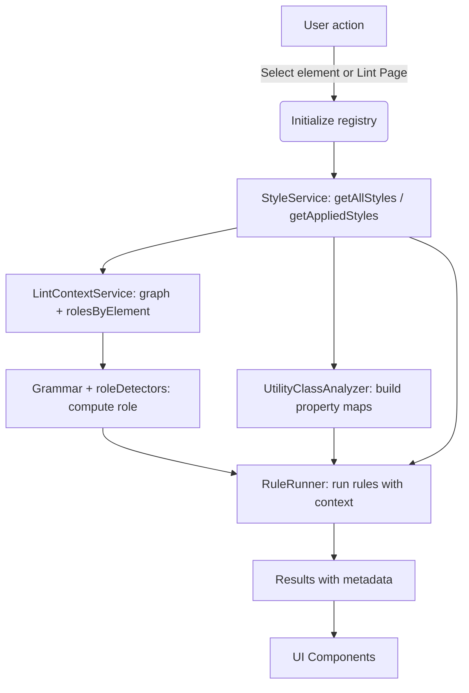

# How It All Works — Webflow Designer Linter

This guide explains the linter end‑to‑end: what happens when you lint a selected element or an entire page, how rules run, how grammar/roles work, how contexts are classified, where configuration and caching live, and how the UI renders results. It reflects the current application state.

## High‑level overview

- The extension runs inside Webflow Designer and exposes a compact UI to lint the selected element or the entire page.
- A shared rule registry is initialized once per session and seeded by the active preset (discovered dynamically) plus persisted configuration.
- Linting gathers styles via the Webflow Designer API, classifies DOM contexts, computes element roles from class names, runs rules, and renders structured results.

```mermaid
flowchart TD
  A[User action] -->|Select element or Lint Page| B(Initialize registry)
  B --> C[StyleService: getAllStyles / getAppliedStyles]
  C --> D[UtilityClassAnalyzer: build property maps]
  C --> E[LintContextService: graph + rolesByElement]
  E --> F[Grammar + roleDetectors: compute role]
  F --> G[RuleRunner: run rules with context]
  D --> G
  C --> G
  G --> H[Results with metadata]
  H --> I[UI Components]
```

## Runtime lifecycles

### Selected element

1. The user selects an element, triggering `useElementLint`.
2. `ensureLinterInitialized()` builds/loads the registry once from the active preset and persisted config.
3. `createElementLintService()` (via `LintContextService` bootstrap)
   - Loads site‑wide styles (cached for the session) and builds utility duplicate maps
   - Retrieves styles for the selected element (or subtree in structural mode) and builds a page/slice graph
   - Runs preset `roleDetectors` with grammar + graph to assign `ElementRole` per element (wrappers reconcile `componentRoot` vs `childGroup` using `detectors/shared/wrapper-detection.ts` when needed)
   - Runs `RuleRunner.runRulesOnStylesWithContext`
   - Stamps `metadata.role` on violations when the runner supplies role metadata
4. `useElementLint` exposes `{ results, classNames, ignoredClassNames, roles, loading, … }` to the UI (`useElementLintStore`).

### Full page

1. The user clicks “Lint Page” → `usePageLintStore.lintPage()`.
2. `ensureLinterInitialized()` ensures the shared registry is ready.
3. `scanCurrentPageWithMeta(elements)` creates a `PageLintService` with a `RuleRunner` configured for the active preset.
4. Loads all site styles, builds utility maps, extracts class names per element.
5. Builds roles via detectors + graph, runs rules across all elements.
6. Store updates `results` and `passedClassNames` and flips loading flags for the UI.

## Presets, grammar, and roles

- Presets live under `src/features/linter/presets/` and define:
  - `id`: preset identifier (e.g., `lumos`, `client-first`, or any custom id)
  - `grammar`: `GrammarAdapter` implementation that parses a class name into a structured `ParsedClass`
  - `roleDetectors` (+ optional `roleDetectionConfig`): score‑based detectors that assign `ElementRole` from DOM/class context
  - `rules`: `Rule[]` (naming, property, structure/composition, page rules as registered)
  - Optional `elementsConfig` for the Recognized Elements UI (see `preset-elements.types.ts`)

### Grammar basics

- Kind detection: `u-` → `utility`, variant-like `is-*`/`is_*`/`isCamelCase` → `combo`, `c-` → `component`, otherwise `custom`.
- `lumos.grammar.ts`: underscore `_` tokens; assign `type`, optional `variation`, and `elementToken` as the last token.
- `client-first.grammar.ts`: normalizes `-` to `_` before tokenization to keep role parsing consistent.

### Role resolution

- Resolves the first custom class only (skips `utility`, `combo`, and `component` kinds).
- Common tokens → roles:
  - `wrap` → `componentRoot` (demoted to `childGroup` when not at a root)
  - `contain|container` → `container`
  - `layout` → `layout`
  - `content|title|text|actions|button|link|icon|list|item` → semantic roles
- Client‑first adds awareness of collection classes and wrapper/section patterns.

## Roles, graph, and wrappers

- **`lint-context.service.ts`** builds cached page (or structural slice) contexts: style snapshots, element graph (`getParentId` / `getChildrenIds` / …), and `rolesByElement` by running the active preset’s `roleDetectors` with `DetectionContext`.
- **`detectors/shared/wrapper-detection.ts`** (`createWrapperDetector`, `isStructuralChildGroup`, `canBeComponentRoot`) reconciles `*_wrap` naming with the graph so `componentRoot` vs `childGroup` matches DOM structure.
- **Preset detectors**: `detectors/lumos.detectors.ts`, `detectors/client-first.detectors.ts` — additional naming and layout heuristics per framework.

## Rule registry and configuration

`src/features/linter/services/registry.ts` and `src/features/linter/model/linter.factory.ts`

- `ensureLinterInitialized(mode = "balanced", preset = currentPreset)`
  - Clears the registry, registers rules from the active preset, applies opinion mode, loads persisted config, merges with schema defaults, updates registry entries.
- `RuleConfigurationService`
  - Persists to `localStorage` under `webflow-linter-rules-config`
  - Merges with each rule’s config schema on load and drops unknown keys
- `RuleRegistry`
  - Stores `Rule` definitions and their `RuleConfiguration`
  - Helpers: get by class type, category, only enabled, export/import config

## Rule execution pipeline

`src/features/linter/services/rule-runner.ts` (`runRulesOnStylesWithContext`)

1. **Page rules** (when enabled): registered `analyzePage` rules run once with `rolesByElement`, graph helpers, and page styles.
2. **Element rules**: for each element, every registered rule that defines `analyzeElement` runs with class lists, graph/role helpers, and `getRuleConfig`.
3. **Per-class rules**: for each applied style row, resolve `ClassType` via the preset’s grammar resolver (with combo flag from Webflow when available), then run enabled **naming** and **property** rules for that type. Naming uses `naming-rule-executor` (`evaluate` when present, else `test`). Property rules use `property-rule-executor` and the utility analyzer where applicable.
4. Utility duplicate metadata comes from `createUtilityClassAnalyzer()` (see below). The runner merges `metadata.role` / `parentId` from the graph when stamping element-scoped results.

`RuleResult` commonly includes `ruleId`, `name`, `message`, `severity`, `className`, `isCombo`, and `metadata` (`elementId`, duplicate-utility fields, ordering/combo hints when a rule supplies them).

## Utility class duplicate analysis

`src/features/linter/services/analyzers/utility-class-analyzer.ts`

- Builds:
  - `utilityClassPropertiesMap`: `u-*` → style entries with properties
  - `propertyToClassesMap`: `prop:value` → set of `u-*` classes
  - Exact full‑property duplicates produce `metadata.exactMatches` (the identical utility class names)
  - For single‑property utilities, also emits a formatted payload: `{ property, value, classes }`

## Style service and caching

`src/entities/style/services/style.service.ts`

- Site styles
  - `getAllStylesWithProperties()` caches site‑wide styles for the session and returns `{ name, properties, order, isCombo, detectionSource }[]`.
  - Combo detection prefers Webflow `style.isComboClass()` when available, with a safe fallback to variant-like prefix (`is-*`, `is_*`, `isCamelCase`). The `detectionSource` indicates `api` or `heuristic`.
- Applied styles
  - `getAppliedStyles(element)` returns deduped styles applied to a Designer element
  - `sortStylesByType(styles)` sorts combos after custom while preserving original order within groups
  - `getAppliedClassNames(element)` extracts class names only (lightweight classification input)
- Cache invalidation
  - `resetStyleServiceCache()` is called when the registry/preset changes

## Processes, hooks, and store

- Processes
  - `src/features/linter/use-cases/scan-selected-element.ts`: scans a single element using the element service and shared registry
  - `src/features/linter/use-cases/scan-current-page.ts`: scans a page using the page service and shared registry; provides `scanCurrentPageWithMeta()` to also return the class set
- Hooks (exported from Zustand stores)
  - `useElementLint` (from `elementLint.store.ts`): ties into Webflow selection changes and returns violations/contexts/classNames/roles
  - `usePageLint` (from `usePageLintStore.ts`): thin wrapper around the page store
- Store
  - `src/features/linter/store/usePageLintStore.ts`: Zustand store holding `results`, `passedClassNames`, `loading`, `error`, `hasRun`, and actions `lintPage()` / `clearResults()`

## UI components

- `LinterPanel.tsx`: wrapper section that wires the page/element mode toggle, actions, and renders results
- `ui/controls/LintPageButton.tsx`: action button (loading state and count)
- `ui/violations/ViolationsList.tsx`: list of `RuleResult` items
- `ui/violations/ViolationItem.tsx` (composes `ui/violations/ViolationHeader` and `ui/violations/ViolationDetails`):
  - badges: severity, context, role, “Unrecognized Element”
  - duplicate utility display: list of identical utility classes (`exactMatches`); for single‑property utilities, a formatted property/value payload with the matching classes
  - ordering section: `currentOrder` and `properOrder`
  - combos section: list and `maxCombos`
  - “Suggested” name when supplied by metadata
  - element highlight button using `selectElementById`
  - in page view, opening a violation accordion item will automatically trigger a highlight for that item’s `metadata.elementId`
- `ui/controls/ModeToggle.tsx`: uses shared `Button` component for consistent styling and a11y
- `ui/controls/PresetSwitcher.tsx`: performs dynamic `import()` to reset style caches on preset changes
- Labels for contexts and roles are centralized in `src/features/linter/lib/labels.ts`

## API surface map (quick reference)

- Preset registry: `src/features/linter/presets/index.ts` → `getPresetIds()`, `resolvePresetOrFallback()`
- Linter lifecycle: `src/features/linter/model/linter.factory.ts` → `ensureLinterInitialized()`, `setPreset()`
- Services: `createElementLintService()`, `createPageLintService()`
- Runner: `createRuleRunner()` → `runRulesOnStylesWithContext()`
- Analyzer: `createUtilityClassAnalyzer()`
- Classifier: `createElementContextClassifier()`
- Style IO: `createStyleService()` → `getAllStylesWithProperties()`, `getAppliedStyles()`

## Development and build

- Dev server
  - Vite plugin (`wfDesignerExtensionPlugin`) injects Designer boot scripts into `index.html` and serves `webflow.json` at `/__webflow`
  - Server runs on port `1337` and restarts on TSX/TS/CSS changes
- Bundling
  - Deterministic output names: `bundle.js` and `styles.css`
  - `pnpm build:dev` and `pnpm build:prod` run `tsc`, Vite build (mode), `webflow extension bundle`, and archive to timestamped zip files under `bundle/development/` or `bundle/prod/`

## Configuration and opinion modes

- `ensureLinterInitialized(mode, preset)` applies opinion mode adjustments and loads persisted rule configuration, merging with schema defaults.
- Active preset can be toggled via `setPreset()` and is read via `getCurrentPreset()`.

## Performance notes

- Site styles are cached for the session; cache is cleared when preset changes.
- Parent map and element class lists are cached per page snapshot signature.
- Utility property maps rebuild only when the count of site styles changes.
- Rule execution minimizes logging and avoids deep DOM walks inside rules.

## Testing

- Run: `pnpm test`, `pnpm test:run`, or `pnpm test:coverage`
- Suites are colocated under `**/__tests__/`; see root `README.md` → **Testing** for layout (rules, services, grammar, presets, `src/__tests__/integration/`, shared utilities)

## Extensibility

- **Presets**: See `docs/guides/extending-presets.md` for creating or extending presets (grammar, detectors, rules).
- Add a new rule by exporting a `Rule` and registering it via the active preset or by calling `addCustomRule(rule)` after initialization.
- UI additions can read structured metadata from `RuleResult.metadata` without changing the core contracts.
