# FlowLint — Product & Technical Plan

_(Current state, target architecture, migration path, and go‑to‑market)_

## 0) Executive summary

FlowLint prevents and reduces Webflow technical debt by linting class naming, utilities, and structural patterns directly inside the Designer. It provides real‑time feedback when debt is cheapest to fix. A future standalone app enables full‑site audits, historical trends, cleanup suggestions, and team config sync.

This document pairs the product plan with the detailed technical architecture. It is accurate to your current extension as described in `linter/README.md` and shows the target Feature‑Sliced Design layout, with a precise migration path.

---

## 1) Problem and audience

### Problem

- Webflow sites accumulate technical debt: inconsistent class naming, duplicate utilities, unclear component boundaries, and fragile layouts.
- New developers spend significant time untangling structure before they can ship new work.

### Who it is for

- Agencies maintaining multiple Webflow sites.
- In‑house teams with long‑lived marketing sites.
- Advanced freelancers who want scalable structure without memorizing framework rules.

---

## 2) Solution overview

### Designer Extension (available now, current state)

- Real‑time linting of the selected element or the entire page.
- Lumos‑style naming rules and utility duplicate detection.
- Context‑aware rules using an element context classifier.

### Standalone App (future)

- Full‑site audits beyond Designer API scope.
- Historical tracking, trend lines, multi‑site dashboards.
- Automated cleanup suggestions and CI‑style gating.
- Team preset sync and versioned configuration.

---

## 3) Current state accuracy (from `linter/README.md`)

### Class types and conventions

- `custom`: underscore‑separated, lowercase alphanumeric, 2–3 segments.
- `utility`: starts with `u-`, dash‑delimited.
- `combo`: starts with `is-`, dash‑delimited.
  The rule runner derives class type from prefixes and chooses rules accordingly.

### Element contexts

- Supported value today: `componentRoot`.
- Classifier defaults:

  - `wrapSuffix`: `_wrap`
  - `parentClassPatterns`: `section_contain`, `/^u-section/`, `/^c-/`

- Behavior: any element with a class ending `_wrap` that has an ancestor matching any parent pattern is classified as `componentRoot`.

### Services and flows

- `style-service.ts`: retrieves all site styles and element‑applied styles.
- `utility-class-analyzer.ts`: builds utility property maps, detects exact duplicates and overlapping properties.
- `rule-registry.ts` and `rule-configuration-service.ts`: register rules, seed defaults from schemas, persist config in `localStorage` under `webflow-linter-rules-config`, merge on load and drop unknown keys.
- `rule-runner.ts`: filters by class type and optional context, executes naming rules (`evaluate` then `test` if present) and property rules, includes formatted metadata for duplicates. Preferred entry is `runRulesOnStylesWithContext(stylesWithElement, contextsMap, allStyles)`.
- `element-context-classifier.ts`: builds a parent map via `getChildren()` traversal and classifies contexts.
- Hooks and store:

  - `useElementLint.ts`: subscribes to `selectedelement`, initializes registry with default + context‑aware rules, loads persisted config, lints the selected element.
  - `usePageLintStore.ts`: performs full‑page lint but currently registers **default rules only**. Context‑aware rules are not registered here.

- UI specifics:

  - Violations list auto‑expands when exactly one violation exists.
  - Duplicate utility issues show structured properties and other classes that share them.

### Known limitation today

- Full‑page lint path registers only default rules. The selected‑element flow initializes the global registry with default + context‑aware rules. This creates a parity gap between page and element scans. Fix proposed below.

---

## 4) Target architecture and naming conventions

We will move to **Feature‑Sliced Design** and 2025 naming standards.

- React components → **PascalCase**
- Hooks → **camelCase** with `use` prefix
- Stores → **camelCase** with `.store.ts` suffix
- Utilities, libs, rules, presets, processes → **kebab‑case**
- Type files → `*.types.ts`

### Target structure

```
/entities
  /style
    model/
      style.types.ts
      style.service.ts
    lib/
      style-utils.ts
  /element
    model/
      element.types.ts
      element-context.types.ts
      element-context-classifier.ts
    lib/
      element-utils.ts

/features
  /linter
    model/
      linter.types.ts
      linter.factory.ts
      rule.types.ts
      rule-runner.ts
      rule-registry.ts
      rule-configuration-service.ts
    lib/
      dom-context-service.ts
      page-scanner.ts
      utility-class-analyzer.ts
      message-parser.ts
      severity-styles.ts
    config/
      codalyn.lint.config.ts
    ui/
      ResultsPanel.tsx
      RuleConfigPanel.tsx
      LintPageButton.tsx
      ViolationsList.tsx
      ViolationItem.tsx
    store/
      pageLint.store.ts
    hooks/
      useElementLint.ts
      usePageLint.ts

/rules
  /naming
    lumos-custom-class-format.ts
    lumos-utility-class-format.ts
    lumos-combo-class-format.ts
  /property
    lumos-utility-class-exact-duplicate.ts
    lumos-utility-class-duplicate-properties.ts
  /context-aware
    component-root-semantic-naming.ts
    component-root-no-display-utilities.ts
    component-root-required-structure.ts

/presets
  lumos.preset.ts
  client-first.preset.ts

/processes
  /scan
    scan-selected-element.ts
    scan-current-page.ts

/shared
  utils/
  types/
```

---

## 5) Contracts and extension points

These contracts keep the core stable and allow adding presets and rules without internal rewrites.

```ts
export type ClassKind = "custom" | "utility" | "combo" | "unknown"; // optionally add "component" later

export type ElementRole =
  | "componentRoot"
  | "childGroup"
  | "container"
  | "layout"
  | "content"
  | "title"
  | "text"
  | "actions"
  | "button"
  | "link"
  | "icon"
  | "list"
  | "item"
  | "unknown";

export interface ParsedClass {
  raw: string;
  kind: ClassKind;
  type?: string;
  variation?: string;
  elementToken?: string;
  tokens?: string[];
}

export interface GrammarAdapter {
  id: string;
  parse(name: string): ParsedClass;
  isCustomFirstRequired?: boolean;
  utilityPrefix?: string;
  componentPrefix?: string;
  comboPrefix?: string;
}

export interface RoleResolver {
  id: string;
  mapToRole(parsed: ParsedClass): ElementRole;
  isContainerLike?(parsed: ParsedClass): boolean;
}

export interface RuleContext {
  elementId: string;
  classList: string[];
  parsedClasses: ParsedClass[];
  nearestComponentRoot?: string;
  elCanHaveChildren: boolean;
  hasChildren: boolean;
  role?: ElementRole;
}

export interface RuleResult {
  id: string;
  message: string;
  severity: "suggestion" | "warning" | "error";
  context?: string; // keep for UI grouping
  metadata?: Record<string, unknown>; // duplicate utility details etc.
}

export interface Rule {
  id: string;
  meta: {
    defaultSeverity: RuleResult["severity"];
    description: string;
    context?: string; // to target context-aware rules (e.g., "componentRoot")
  };
  run(ctx: RuleContext): RuleResult[];
}

export interface Preset {
  id: string;
  grammar: GrammarAdapter;
  roles: RoleResolver;
  rules: Rule[];
  ruleConfig?: Record<
    string,
    {
      enabled?: boolean;
      severity?: RuleResult["severity"];
      options?: Record<string, unknown>;
    }
  >;
}

export interface ProjectConfig {
  preset: string; // "lumos" by default
  opinionMode?: "strict" | "balanced" | "lenient";
  overrides?: {
    grammar?: Partial<GrammarAdapter>;
    roleAliases?: Record<string, ElementRole>;
    rules?: Record<
      string,
      {
        enabled?: boolean;
        severity?: RuleResult["severity"];
        options?: Record<string, unknown>;
      }
    >;
  };
}
```

---

## 6) Execution lifecycle and data flow

### Element lint lifecycle

```text
User selects element
→ getAllElements() and selected element details
→ style.service gets styles, classList
→ element-context-classifier builds page parent map and contexts
→ grammar.parse for each class; roles.mapToRole for first custom class or tokens
→ rule-runner filters rules by class kind and context
→ rule-runner executes naming and property rules
→ results enriched with metadata (duplicate utilities)
→ ResultsPanel renders grouped by context and severity
```

### Page lint lifecycle

```text
User clicks Lint Page
→ getAllElements()
→ style.service maps element → styles
→ utility-class-analyzer builds property maps once per scan
→ element-context-classifier classifies contexts
→ rule-runner executes across all elements
→ store holds results for UI sections
```

**Gap today that you called out:** full‑page lint path registers default rules only. Selected‑element path initializes default + context‑aware.
**Fix:** unify registry initialization at a single boot point used by both flows, either in `/processes/scan/scan-bootstrap.ts` or in the store constructor. Ensure both page and element scans read the same registry instance.

---

## 7) Configuration and persistence

- Persist per‑project rule configuration in `localStorage` as today under `webflow-linter-rules-config`.
- On load, merge with rule schema defaults and drop unknown keys.
- For the standalone app, plan a config model that stores:

  - organization_id, project_id, preset_id, version, overrides, opinionMode
  - audit snapshots that reference the config version used at the time

Example project config (target):

```ts
export default defineConfig({
  preset: "lumos",
  opinionMode: "strict",
  overrides: {
    rules: {
      "container/children": { severity: "warning" },
    },
  },
});
```

---

## 8) Testing strategy

- **Unit**

  - Grammar adapters: class string → ParsedClass.
  - Role resolvers: ParsedClass → ElementRole.
  - Rules: RuleContext → RuleResult\[].

- **Integration**

  - Scan pipeline with mocked Designer objects.
  - Parity tests: legacy vs preset‑based results for Lumos.

- **Golden tests**

  - Rule message snapshots to ensure message stability.

- **Coverage goals**

  - Grammar and roles: 100 percent.
  - Each rule: at least one test per branch.

---

## 9) Performance guidelines

- Build DOM maps once per scan.
- Cache `getStyles()` results per element within a scan.
- Avoid ancestor walks inside rules. Compute nearest `_wrap` once.
- Debounce scans and prefer incremental scans on selection change.
- Expose scan budget in UI for large pages.

---

## 10) UX principles

- Violations list auto‑expands when there is exactly one violation.
- Group violations by component root and role to match mental models.
- Keep messages concise and directive with clear next steps.
- Provide one‑click actions where possible:

  - Copy class list
  - Jump to element
  - Mute rule for the session or demote to suggestion

- Offer modes:

  - Suggestion‑only for non‑technical users
  - Balanced with warnings
  - Strict for teams that want enforcement

---

## 11) Standalone app scope and API surface

- **Audits**

  - Unused classes across the site
  - Duplicate utilities across pages
  - Inconsistent naming and structure patterns
  - Bundle size impact from utility sprawl

- **Data model**

  - Project, Site, AuditSnapshot, RuleFinding, RuleConfigVersion
  - Each Snapshot stores the rule config hash and preset version

- **APIs**

  - Preset and RuleConfig sync to the extension
  - Audit result ingestion from extension or site export
  - Report export (PDF, JSON) for clients

- **Workflows**

  - Agency dashboard across multiple clients
  - Trend lines per site
  - CI‑like gates on publish in Designer or via a companion workflow

---

## 12) Risks and mitigations

| Risk                                | Impact                              | Mitigation                                               |
| ----------------------------------- | ----------------------------------- | -------------------------------------------------------- |
| Designer API limitations            | Some audits require whole‑site data | Delegate to standalone app using API or export           |
| UX friction for non‑technical users | Reduced adoption                    | Suggestion‑first default, simple language, guided fixes  |
| Performance on large pages          | Slow feedback                       | Debounce, batch work, precompute maps once               |
| Config drift between teammates      | Inconsistent results                | Central config sync in standalone app, versioned presets |
| Rule set disagreements              | Preset rejection                    | Multiple presets plus custom overrides                   |

---

## 13) Roadmap and phases

- **Phase 1**

  - Create shadow FSD structure
  - Move types and non‑critical services
  - Unify registry initialization for both element and page scans
  - Ensure parity tests for Lumos rules

- **Phase 2**

  - Split rules into category folders
  - Add `lumos.preset.ts` and opinion modes
  - Add Client‑First preset

- **Phase 3**

  - Standalone app foundation: data model, API, auth
  - Full‑site audits, historical tracking
  - Team config sync

- **Phase 4**

  - Automated cleanup suggestions
  - CI‑style gating and reporting

---

## 14) Success metrics

- Adoption: monthly active extension users
- Quality impact: violation count reduction per site over time
- Retention: 3‑month active rate
- Conversion: free to pro
- Agency penetration: number of teams with shared presets

---

## 15) Diagrams for documentation

### Current architecture


### Target FSD architecture and naming


### Migration overlay with legend

```mermaid
graph LR
    subgraph Legend
        L1[🟦 Direct move]
        L2[🟩 New or split]
        L3[🟧 Renamed for 2025]
        L4[🟥 Deleted or merged]
    end
    subgraph Current
        C_UEL[🟦 useElementLint.ts]
        C_UPL[🟦 usePageLint.ts]
        C_PLS[🟦 usePageLintStore.ts]
        C_SS[🟦 style-service.ts]
        C_UCA[🟦 utility-class-analyzer.ts]
        C_RR[🟦 rule-runner.ts]
        C_REG[🟦 rule-registry.ts]
        C_RCS[🟦 rule-configuration-service.ts]
        C_REGY[🟥 registry.ts]
        C_ECC[🟦 element-context-classifier.ts]
        C_MP[🟦 message-parser.ts]
        C_SEV[🟦 severity-styles.ts]
        C_DR[🟧 default-rules.ts]
        C_CAR[🟧 context-aware-rules.ts]
        C_RT[🟦 rule-types.ts]
        C_EC[🟦 element-context.ts]
        C_LP[🟧 LintPanel.tsx]
        C_PLSec[🟧 PageLintSection.tsx]
        C_LPB[🟧 LintPageButton.tsx]
        C_VL[🟧 ViolationsList.tsx]
        C_VI[🟧 ViolationItem.tsx]
    end
    subgraph Target
        T_UEL[🟦 useElementLint.ts]
        T_UPL[🟦 usePageLint.ts]
        T_PLS[🟦 pageLint.store.ts]
        T_STYLESVC[🟦 style.service.ts]
        T_UCA[🟦 utility-class-analyzer.ts]
        T_RR[🟦 rule-runner.ts]
        T_REG[🟦 rule-registry.ts]
        T_RCS[🟦 rule-configuration-service.ts]
        T_SCAN_E[🟩 scan-selected-element.ts]
        T_SCAN_P[🟩 scan-current-page.ts]
        T_ECC[🟦 element-context-classifier.ts]
        T_MP[🟦 message-parser.ts]
        T_SEV[🟦 severity-styles.ts]
        T_NR1[🟩 lumos-custom-class-format.ts]
        T_NR2[🟩 lumos-utility-class-format.ts]
        T_NR3[🟩 lumos-combo-class-format.ts]
        T_PR1[🟩 lumos-utility-class-exact-duplicate.ts]
        T_PR2[🟩 lumos-utility-class-duplicate-properties.ts]
        T_CR1[🟩 component-root-semantic-naming.ts]
        T_CR2[🟩 component-root-no-display-utilities.ts]
        T_CR3[🟩 component-root-required-structure.ts]
        T_RT[🟦 rule.types.ts]
        T_ECT[🟦 element-context.types.ts]
        T_RP[🟧 ResultsPanel.tsx]
        T_RCP[🟩 RuleConfigPanel.tsx]
        T_LPB[🟧 LintPageButton.tsx]
        T_VL[🟧 ViolationsList.tsx]
        T_VI[🟧 ViolationItem.tsx]
        T_LUM[🟩 lumos.preset.ts]
        T_CF[🟩 client-first.preset.ts]
    end
    C_UEL --> T_UEL
    C_UPL --> T_UPL
    C_PLS --> T_PLS
    C_SS --> T_STYLESVC
    C_UCA --> T_UCA
    C_RR --> T_RR
    C_REG --> T_REG
    C_RCS --> T_RCS
    C_REGY --> T_SCAN_E
    C_REGY --> T_SCAN_P
    C_ECC --> T_ECC
    C_MP --> T_MP
    C_SEV --> T_SEV
    C_DR --> T_NR1
    C_DR --> T_NR2
    C_DR --> T_NR3
    C_DR --> T_LUM
    C_CAR --> T_CR1
    C_CAR --> T_CR2
    C_CAR --> T_CR3
    C_RT --> T_RT
    C_EC --> T_ECT
    C_LP --> T_RP
    C_PLSec --> T_RP
    C_LPB --> T_LPB
    C_VL --> T_VL
    C_VI --> T_VI
```



---

## 16) Action items

1. Create FSD shadow directories and move type files first.
2. Extract registry bootstrap so both page and element paths register the same rule set, including context‑aware rules.
3. Split rule files into category folders and add `lumos.preset.ts`.
4. Add integration tests that compare legacy results to preset‑based results for Lumos.
5. Draft standalone app data model and API for config sync and audit snapshots so extension code can anticipate it.
