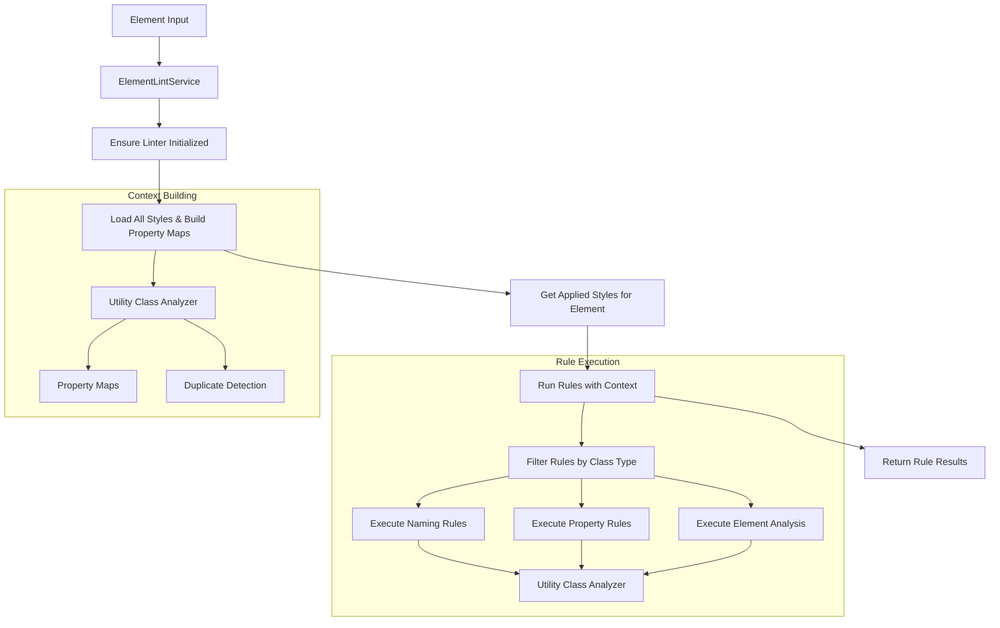
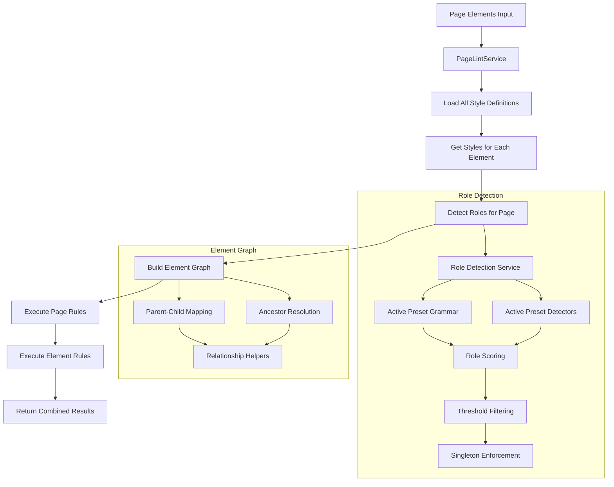
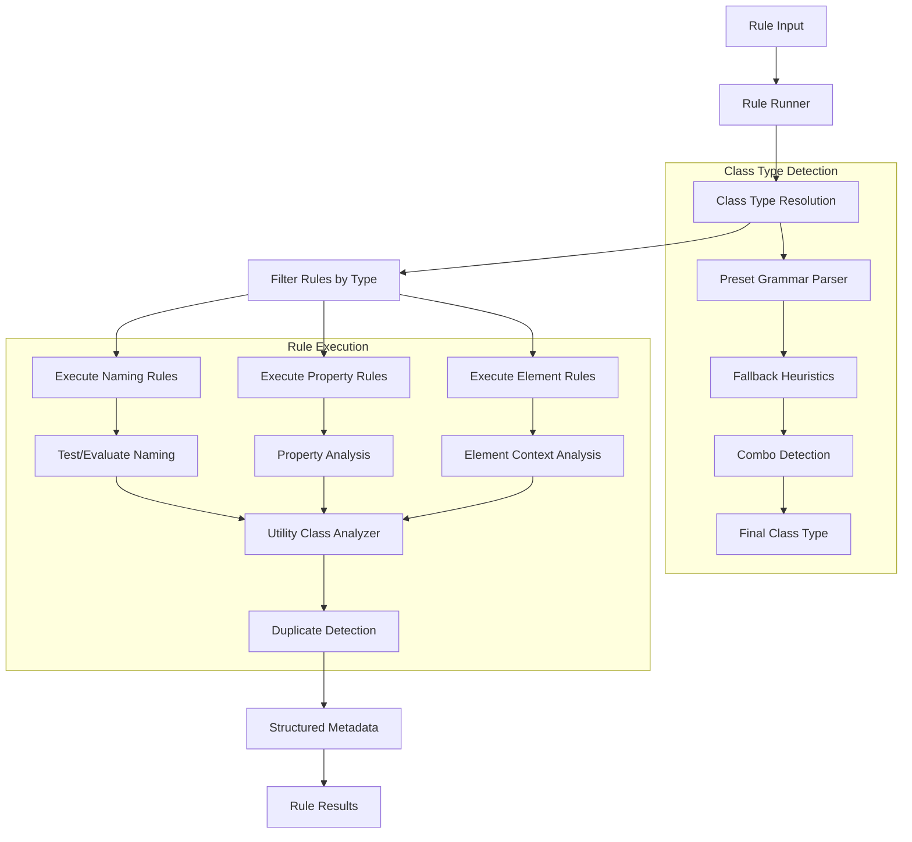
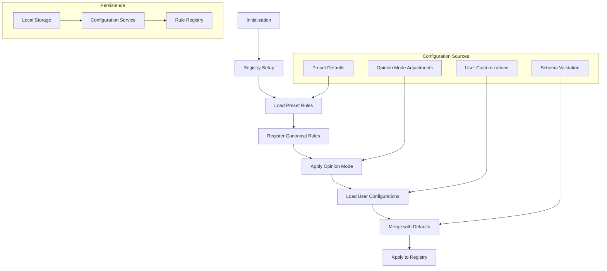
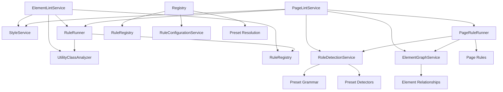

# Linter Services

This directory contains the core services that power the Webflow linter functionality. Each service has a specific responsibility and works together to provide comprehensive linting capabilities.

## Service Overview

### Core Linting Services

#### `element-lint-service.ts`

- **Purpose**: Orchestrates individual element scans
- **Key Functions**:
  - `lintElement(element)`: Lints a single Webflow element
  - `lintElementWithMeta(element)`: Returns lint results with applied class names and detected roles
- **Responsibilities**:
  - Ensures linter initialization
  - Builds property maps from all site styles
  - Retrieves and validates applied styles on the element
  - Runs rules with element context and role information
  - Provides fallback for elements without styles

**Detailed Description**: This service is the primary entry point for linting individual Webflow elements. It orchestrates the entire element scanning process by first ensuring the linter is properly initialized, then building comprehensive property maps from all site styles to provide context for rule execution. The service retrieves and validates the styles applied to the target element, maintaining the association between styles and elements. It then runs the appropriate rules with full element context and role information, allowing for comprehensive analysis. The service also handles edge cases, such as elements without any assigned styles, by providing appropriate fallback behavior and error handling. The service includes role detection for the current element and caches role information for performance.

#### `page-lint-service.ts`

- **Purpose**: Orchestrates full page scans across all elements
- **Key Functions**:
  - `lintCurrentPage(elements)`: Lints all elements on the current page
- **Responsibilities**:
  - Loads all style definitions for rule context
  - Gathers styles for each element while maintaining element association
  - Detects roles using the role detection service
  - Builds element graph for relationship analysis
  - Executes page-scope canonical rules
  - Provides comprehensive page-level linting results

**Detailed Description**: The page lint service provides comprehensive linting across entire pages by orchestrating scans of all elements simultaneously. It begins by loading every style definition from the site to provide complete context for rule execution. The service then processes each element individually, gathering all applied styles while maintaining the crucial association between styles and their target elements. It leverages the role detection service to identify semantic roles for elements, which enables more sophisticated rule analysis. The service builds an element graph that captures parent-child relationships and ancestry information, supporting page-scope rules that need to analyze element relationships. Finally, it executes both page-level canonical rules (such as main singleton validation) and element-level rules, combining the results into a comprehensive page analysis. The service includes intelligent caching of role detection results based on page signature changes.

#### `rule-runner.ts`

- **Purpose**: Core rule execution engine
- **Key Functions**:
  - `runRulesOnStylesWithContext(stylesWithElement, elementContextsMap, allStyles, rolesByElement?, getParentId?, getChildrenIds?, getAncestorIds?, parseClass?)`: Main API for running rules with full context
- **Responsibilities**:
  - Filters rules by resolved class type (utility, combo, custom)
  - Executes naming, property, and element-level analysis rules
  - Handles duplicate detection using utility class analyzer
  - Provides class kind resolution with fallback heuristics
  - Emits structured metadata including role, element context, and detection source

**Detailed Description**: The rule runner is the heart of the linting system, responsible for executing all rules with comprehensive context. It provides a sophisticated rule filtering system that categorizes rules by class type (utility, combo, or custom) and ensures only relevant rules are executed for each class. The service supports multiple rule types including naming validation, property analysis, and element-level analysis, with each rule type receiving appropriate context and data. It integrates with the utility class analyzer to detect duplicates across any class type, providing detailed information about property overlaps and exact matches. The runner includes intelligent class kind resolution that can fall back to heuristics when preset grammar is unavailable, ensuring robust operation. All rule execution results include rich metadata such as element IDs, detected roles, parent relationships, and detection source information, enabling comprehensive reporting and debugging. The runner processes rules in two phases: element-level analysis followed by class-level analysis, ensuring comprehensive coverage. It also handles combo class indexing for stable ordering and provides comprehensive context to rules including element relationships and role information.

### Role Detection & Analysis

#### `role-detection.service.ts`

- **Purpose**: Identifies semantic roles for elements using preset grammar and detectors
- **Key Functions**:
  - `detectRolesForPage(elements)`: Returns role mapping for all elements
- **Features**:
  - Configurable confidence threshold (default: 0.6)
  - Enforces singleton `main` role by keeping highest-scoring candidate
  - Uses active preset grammar and detectors
  - Returns `RolesByElement` mapping

**Detailed Description**: This service provides intelligent semantic role detection for elements by analyzing their class names and characteristics using the active preset's grammar and role detectors. It implements a sophisticated scoring system where each detector evaluates elements and assigns confidence scores for different roles. The service enforces important semantic constraints, such as ensuring only one element can have the `main` role on a page by keeping the highest-scoring candidate and marking others as `unknown`. The configurable confidence threshold allows for fine-tuning the balance between precision and recall in role detection. The service processes all elements on a page simultaneously, building a comprehensive role mapping that can be used by other services and rules to provide context-aware analysis. This role information is crucial for enforcing page-level structural rules and providing meaningful feedback to users about element semantics.

#### `element-graph.service.ts`

- **Purpose**: Builds and provides element relationship data
- **Key Functions**:
  - `getParentId(id)`: Returns parent element ID
  - `getChildrenIds(id)`: Returns array of child element IDs
  - `getAncestorIds(id)`: Returns array of ancestor element IDs
- **Use Cases**: Supports page-scope rules that need to analyze element relationships

**Detailed Description**: The element graph service constructs and maintains a comprehensive representation of element relationships within a page. It builds a graph structure that captures the hierarchical relationships between elements, enabling efficient traversal and analysis of element ancestry and descendants. The service provides three key relationship queries: parent identification, child enumeration, and ancestor resolution. The parent and child relationships are directly mapped from the DOM structure, while ancestor resolution involves traversing up the hierarchy to identify all elements in the ancestry chain. This relationship data is essential for page-scope rules that need to validate structural constraints, such as ensuring sections are properly nested within main content areas or that component hierarchies follow expected patterns. The service is designed for performance, rebuilding the graph efficiently when page structure changes and providing fast lookup access for relationship queries.

#### `page-rule-runner.ts`

- **Purpose**: Executes page-scope rules that analyze multiple elements and relationships
- **Key Functions**:
  - `run(rules, context)`: Executes page rules with full context
- **Supported Rules**: Canonical page rules (e.g., main singleton, main content validation)

**Detailed Description**: The page rule runner specializes in executing rules that require analysis across multiple elements and their relationships. Unlike element-level rules that focus on individual elements, page rules can examine the broader page structure, element hierarchies, and cross-element relationships. The service provides a consistent execution environment for page rules, passing comprehensive context including role mappings, element relationships, and structural information. It supports canonical page rules that enforce fundamental page structure requirements, such as ensuring there's exactly one main content area or validating that main content contains appropriate child elements. The runner is designed to work seamlessly with the element graph service and role detection service, providing page rules with all the context they need to perform comprehensive structural analysis. This enables sophisticated validation of page architecture and helps maintain consistent, well-structured layouts.

### Utility Analysis

#### `utility-class-analyzer.ts`

- **Purpose**: Analyzes all classes for duplicate properties and exact matches
- **Key Functions**:
  - `buildPropertyMaps(allStyles)`: Builds property analysis maps
  - `analyzeDuplicates(className, properties)`: Detects duplicates for a class
  - `getUtilityClassPropertiesMap()`: Returns the class properties mapping
  - `getPropertyToClassesMap()`: Returns property-to-classes mapping
  - `getExactPropertiesToClassesMap()`: Returns exact properties mapping
- **Features**:
  - Indexes all classes (not just utility classes)
  - Ignores classes with zero unique properties
  - Detects per-property duplicates via `propertyToClassesMap`
  - Identifies exact property matches via class fingerprinting
  - Provides formatted property information for display

**Detailed Description**: The utility class analyzer provides comprehensive analysis of CSS classes to identify duplicates, overlaps, and inefficiencies. Despite its name, it analyzes all classes in the system, not just utility classes, providing a complete picture of property usage across the entire stylesheet. The service builds sophisticated property maps that track which classes use specific CSS properties, enabling detection of both partial and complete property overlaps. It implements intelligent filtering to ignore classes with no unique properties, focusing analysis on classes that actually contribute to the styling. The analyzer provides two levels of duplicate detection: per-property duplicates that show which classes share individual properties, and exact matches that identify classes with identical property sets. It includes sophisticated property normalization to handle CSS property variations and provides formatted output that makes duplicate information easily digestible for users. The service exposes getter methods for accessing the internal property maps, enabling external services to perform custom analysis. This analysis is crucial for identifying redundant CSS, optimizing stylesheets, and maintaining clean, efficient styling systems.

### Registry & Configuration

#### `rule-registry.ts`

- **Purpose**: Manages rule registration, retrieval, and filtering
- **Key Functions**:
  - `registerRule(rule)`: Registers a single rule
  - `registerRules(rules)`: Registers multiple rules
  - `getRulesByClassType(type)`: Filters rules by class type
  - `getRulesByCategory(category)`: Filters rules by category
  - `getEnabledRules()`: Returns only enabled rules
  - `getAllConfigurations()`: Returns all rule configurations
  - `exportConfiguration()`: Exports configurations to JSON
  - `importConfiguration(json)`: Imports configurations from JSON
- **Features**:
  - Automatic default configuration seeding
  - Rule filtering by various criteria
  - Configuration management integration
  - Import/export capabilities for configuration sharing

**Detailed Description**: The rule registry serves as the central repository for all linting rules in the system, providing comprehensive rule management capabilities. It handles the complete lifecycle of rules from registration through execution, including automatic configuration seeding based on rule schemas. The registry implements sophisticated filtering capabilities that allow rules to be retrieved by class type (utility, combo, custom), category (naming, property, structure), or enabled status. It maintains rule configurations alongside rule definitions, ensuring that settings are properly associated and persisted. The registry integrates closely with the configuration service to provide seamless rule customization and persistence. It supports dynamic rule addition, allowing custom rules to be registered at runtime, and provides efficient rule lookup for the rule runner. The registry includes import/export functionality for configuration sharing and backup, with robust error handling for malformed configurations. It's designed to handle large numbers of rules efficiently while maintaining fast access patterns for rule execution and configuration management.

#### `rule-configuration-service.ts`

- **Purpose**: Manages rule configuration persistence and user customizations
- **Key Functions**:
  - `saveConfiguration(configs)`: Persists rule configurations
  - `loadConfiguration()`: Loads and merges stored configurations
- **Features**:
  - Local storage persistence
  - User configuration merging with defaults
  - Schema validation for custom settings
  - Configuration versioning

**Detailed Description**: The rule configuration service provides sophisticated configuration management that balances user customization with system stability. It implements a robust persistence layer using local storage, ensuring that user preferences survive browser sessions and page reloads. The service includes intelligent configuration merging that combines user customizations with system defaults, preventing configuration drift while respecting user preferences. It implements schema validation for custom settings, ensuring that configuration changes are valid and won't cause system instability. The service handles configuration versioning, allowing for graceful upgrades when rule schemas change. It provides comprehensive error handling for malformed configurations, falling back to defaults when necessary. The service integrates closely with the rule registry to ensure that configuration changes are immediately reflected in rule execution, providing real-time customization capabilities. This enables users to tailor the linting system to their specific needs while maintaining system reliability.

#### `registry.ts`

- **Purpose**: Global registry initialization and management
- **Key Functions**:
  - `initializeRuleRegistry(mode, presetId)`: Sets up the global rule registry
  - `addCustomRule(rule)`: Adds custom rules dynamically
- **Features**:
  - Preset rule registration
  - Canonical rule registration (preset-agnostic)
  - Opinion mode application
  - User configuration loading and application

**Detailed Description**: The global registry service orchestrates the complete initialization and setup of the linting system. It manages the complex process of bringing the system online, including loading preset rules, registering canonical rules that apply across all presets, and applying opinion mode adjustments that modify rule behavior based on user preferences. The service handles preset resolution and fallback, ensuring that the system always has a valid rule set even when preset loading fails. It implements opinion mode application that can adjust rule severity and behavior based on user preferences for strictness or leniency. The service coordinates with the configuration service to load and apply user customizations, ensuring that the system reflects user preferences while maintaining system integrity. It supports dynamic rule addition, allowing custom rules to be registered at runtime for specialized use cases. The service provides comprehensive logging and error handling during initialization, making it easier to diagnose and resolve startup issues.

## Data Flow Diagrams

### Element Linting Flow



### Page Linting Flow



### Rule Execution Flow



### Configuration Management Flow



## Service Dependencies



## Key Interfaces

### Rule Execution Context

```typescript
interface RuleExecutionContext {
  styles: StyleWithElement[];
  elementContextsMap: Record<string, ElementContext>;
  allStyles: StyleInfo[];
  rolesByElement?: RolesByElement;
  getParentId?: (id: string) => string | null;
  getChildrenIds?: (id: string) => string[];
  getAncestorIds?: (id: string) => string[];
  parseClass?: (name: string) => ParsedClass;
}
```

### Role Detection Result

```typescript
interface RolesByElement {
  [elementId: string]: ElementRole;
}
```

### Element Graph Interface

```typescript
interface ElementGraph {
  getParentId: (id: string) => string | null;
  getChildrenIds: (id: string) => string[];
  getAncestorIds: (id: string) => string[];
}
```

## Usage Patterns

### Element-Level Linting

```typescript
const elementService = createElementLintService();
const results = await elementService.lintElement(webflowElement);
```

### Page-Level Linting

```typescript
const pageService = createPageLintService(styleService, ruleRunner);
const results = await pageService.lintCurrentPage(elements);
```

### Role Detection

```typescript
const roleService = createRoleDetectionService({
  grammar: activePreset.grammar,
  detectors: activePreset.detectors,
  config: { threshold: 0.7 },
});
const roles = roleService.detectRolesForPage(elements);
```

### Rule Execution

```typescript
const runner = createRuleRunner(registry, utilityAnalyzer, classKindResolver);
const results = runner.runRulesOnStylesWithContext(
  styles,
  elementContexts,
  allStyles,
  rolesByElement,
  getParentId,
  getChildrenIds,
  getAncestorIds
);
```

## Testing

The services include comprehensive test coverage in the `__tests__/` directory, covering:

- Rule execution logic
- Grammar parsing
- Rule message formatting
- Rule template functionality

Run tests with: `pnpm test`
