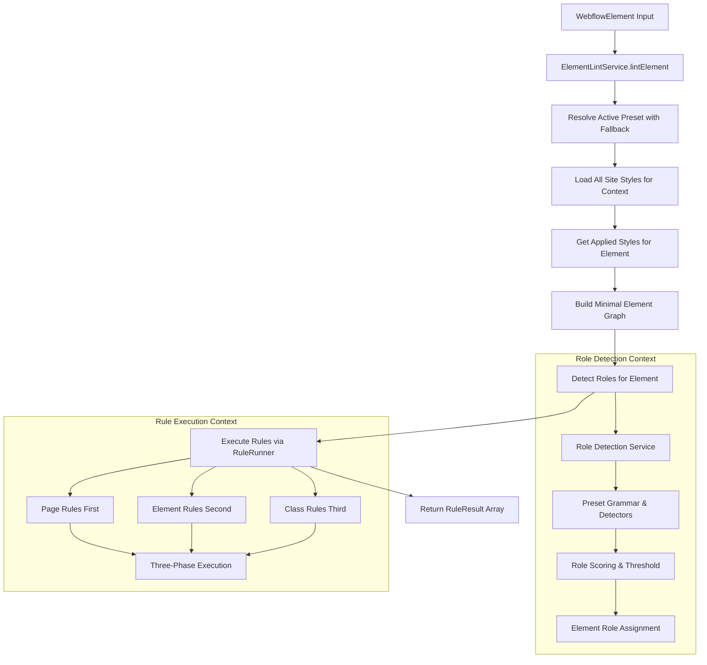
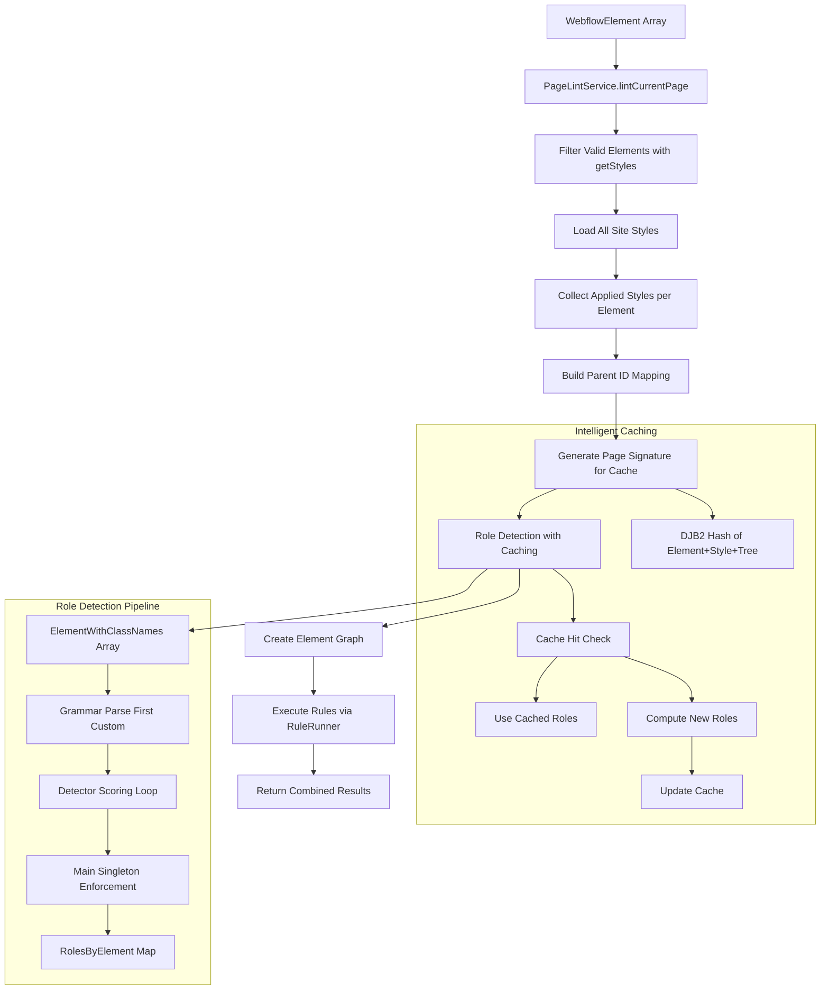
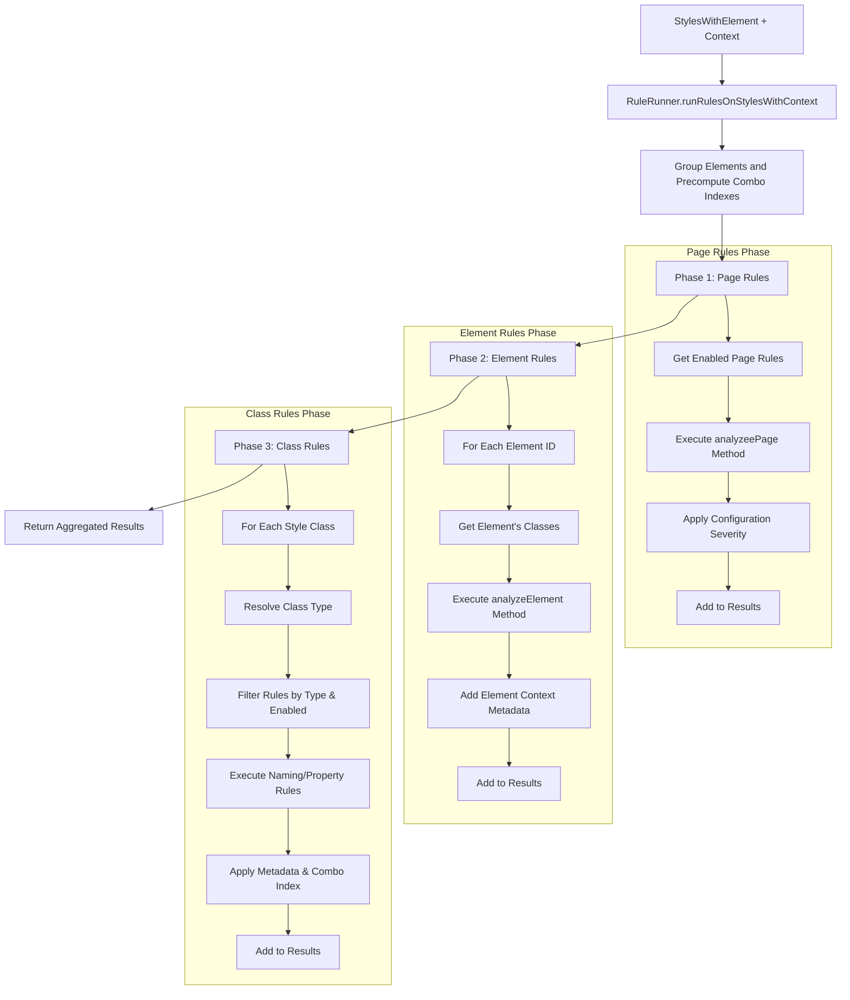
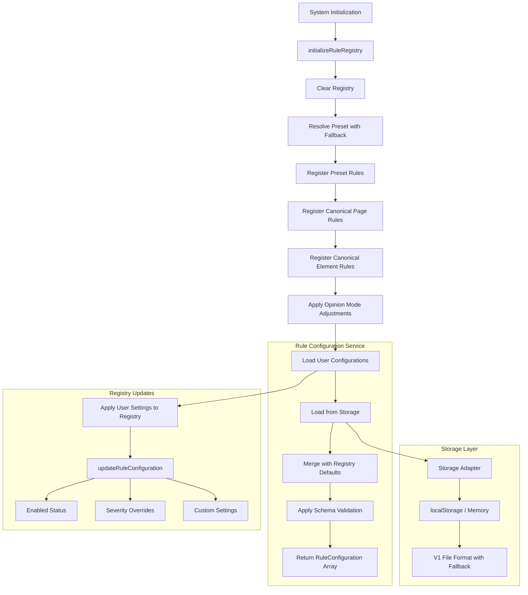
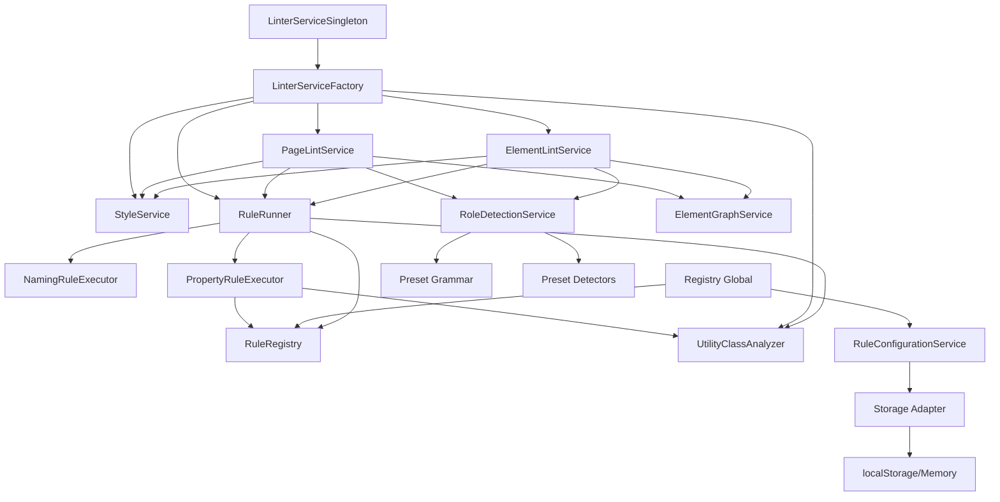

# Linter Services

This directory contains the core services that power the Webflow linter functionality. Each service has a specific responsibility and works together to provide comprehensive linting capabilities.

## Service Overview

### Core Linting Services

#### `element-lint-service.ts`

- **Purpose**: Orchestrates individual element scans with role detection and graph context
- **Key Functions**:
  - `lintElement(element: WebflowElement): Promise<RuleResult[]>`: Lints a single Webflow element
- **Dependencies**:
  - `StyleService`: For retrieving style information
  - `RuleRunner`: For executing linting rules
- **File Reference**: [`src/features/linter/services/element-lint-service.ts`](./element-lint-service.ts)

**Detailed Description**: This service is the primary entry point for linting individual Webflow elements. It resolves the active preset with fallback to Lumos grammar, ensuring consistent rule execution context. The service loads all site-wide style information for comprehensive property analysis, then retrieves and maps applied styles to the target element. It builds a minimal element graph around the target element to support relationship-aware rules, and performs role detection using the same service as page-level scans for consistency. Finally, it executes rules via the shared rule runner API, maintaining parity with page-level linting. The service handles errors gracefully and provides role context for more sophisticated rule analysis.

#### `page-lint-service.ts`

- **Purpose**: Orchestrates full page scans across all elements with intelligent caching
- **Key Functions**:
  - `lintCurrentPage(elements: WebflowElement[]): Promise<RuleResult[]>`: Lints all elements on the current page
- **Dependencies**:
  - `StyleService`: For retrieving style information
  - `RuleRunner`: For executing linting rules
- **File Reference**: [`src/features/linter/services/page-lint-service.ts`](./page-lint-service.ts)

**Detailed Description**: The page lint service provides comprehensive linting across entire pages by orchestrating scans of all elements simultaneously. It filters elements to only those supporting the `getStyles()` method, then loads all site-wide style definitions to provide complete context for rule execution. The service collects applied styles for each element while maintaining element-to-style associations, and builds a parent mapping for graph helpers and role scoring. It implements intelligent role detection caching using a DJB2-based page signature that includes element IDs, class names, and parent relationships to avoid redundant role computation. The service creates an element graph for relationship analysis and executes rules via the shared rule runner, which handles both page-scope canonical rules and element-level rules. The entire process is optimized for performance with signature-based caching and efficient data structures.

#### `rule-runner.ts`

- **Purpose**: Core rule execution engine with support for page-scope and element-scope rules
- **Key Functions**:
  - `runRulesOnStylesWithContext()`: Main API for running rules with full context
- **Dependencies**:
  - `RuleRegistry`: For rule retrieval and configuration
  - `UtilityClassAnalyzer`: For duplicate detection
  - `ClassTypeResolver`: For class type determination
- **File Reference**: [`src/features/linter/services/rule-runner.ts`](./rule-runner.ts)

**Detailed Description**: The rule runner is the heart of the linting system, orchestrating execution of page-scope, element-scope, and class-scope rules. It implements a sophisticated three-phase execution model: first executing page rules that analyze cross-element relationships, then element-level rules for individual element analysis, and finally class-level rules for naming and property validation. The service includes intelligent class type resolution with fallback heuristics when preset grammar is unavailable. It pre-computes combo class indexes per element for stable ordering and integrates with the utility class analyzer for duplicate detection. All rule execution results include rich metadata such as element IDs, detected roles, parent relationships, and detection source information. The runner handles rule configuration overrides, severity resolution, and provides comprehensive error handling with detailed logging for debugging failed rule execution.

### Role Detection & Analysis

#### `role-detection.service.ts`

- **Purpose**: Identifies semantic roles for elements using preset grammar and detectors
- **Key Functions**:
  - `detectRolesForPage(elements: ElementWithClassNames[]): RolesByElement`: Returns role mapping for all elements
- **Configuration**:
  - Configurable confidence threshold (default: 0.6)
  - Enforces singleton `main` role by keeping highest-scoring candidate
  - Uses active preset grammar and detectors
- **File Reference**: [`src/features/linter/services/role-detection.service.ts`](./role-detection.service.ts)

**Detailed Description**: This service provides intelligent semantic role detection for elements by analyzing their class names and characteristics using the active preset's grammar and role detectors. It implements a sophisticated scoring system where each detector evaluates elements and assigns confidence scores for different roles. The service builds parent maps to compute ancestry information for context-aware role detection, and extracts the first custom class parsed by the active grammar for role analysis. It enforces the singleton main constraint by tracking scores for all main candidates and keeping only the highest-scoring one, demoting others to unknown. The service includes robust error handling for detector failures and element ID extraction, with configurable thresholding to balance precision and recall. Role detection results are used throughout the system for context-aware rule execution and structural validation.

#### `element-graph.service.ts` _(External Dependency)_

- **Purpose**: Builds and provides element relationship data for traversal analysis
- **Key Functions**:
  - `getParentId(id: string): string | null`: Returns parent element ID
  - `getChildrenIds(id: string): string[]`: Returns array of child element IDs
  - `getAncestorIds(id: string): string[]`: Returns array of ancestor element IDs
- **Location**: [`src/entities/element/services/element-graph.service.ts`](../../entities/element/services/element-graph.service.ts)

**Detailed Description**: The element graph service constructs a comprehensive representation of element relationships within a page by building maps of parent-child relationships and children-by-parent indexes. It provides stable element ID extraction handling multiple Webflow element formats and implements efficient ancestor traversal with cycle detection. The service creates bidirectional relationship mappings from a parent lookup table and element list, enabling fast queries for relationship analysis. This relationship data is essential for page-scope rules that validate structural constraints and for role detection that considers element context within the page hierarchy.

### Utility Analysis

#### `analyzers/utility-class-analyzer.ts`

- **Purpose**: Analyzes all classes for duplicate properties and exact matches with intelligent caching
- **Key Functions**:
  - `buildPropertyMaps(allStyles: StyleInfo[]): void`: Builds property analysis maps
  - `analyzeDuplicates(className: string, properties: CSSPropertiesDict): UtilityClassDuplicateInfo | null`: Detects duplicates for a class
  - `getUtilityClassPropertiesMap()`: Returns the class properties mapping
  - `getPropertyToClassesMap()`: Returns property-to-classes mapping
  - `getExactPropertiesToClassesMap()`: Returns exact properties mapping
  - `ensureBuilt(allStyles: StyleInfo[]): void`: Ensures maps are built with cache validation
- **Configuration**:
  - Optional `isUtilityName` classifier for filtering classes to analyze
  - Debug mode for detailed duplicate logging
- **File Reference**: [`src/features/linter/services/analyzers/utility-class-analyzer.ts`](./analyzers/utility-class-analyzer.ts)

**Detailed Description**: The utility class analyzer provides comprehensive analysis of CSS classes to identify duplicates, overlaps, and inefficiencies with intelligent hash-based caching. It builds sophisticated property maps that track which classes use specific CSS properties and implements stable JSON serialization for consistent cache keys. The analyzer provides two levels of duplicate detection: per-property duplicates that show which classes share individual properties, and exact matches that identify classes with identical property sets via fingerprinting. It includes optional grammar-aware filtering to analyze only utility classes when configured, and provides formatted property information for single-property classes. The service implements intelligent cache invalidation based on style content hashing to avoid unnecessary rebuilds, and includes comprehensive debugging capabilities for analyzing duplicate patterns across the stylesheet.

### Registry & Configuration

#### `rule-registry.ts`

- **Purpose**: Manages rule registration, retrieval, and filtering for both element-scope and page-scope rules
- **Key Functions**:
  - `registerRule(rule: Rule): void`: Registers a single element-scope rule
  - `registerRules(rules: Rule[]): void`: Registers multiple element-scope rules
  - `registerPageRule(rule: PageRule): void`: Registers a single page-scope rule
  - `registerPageRules(rules: PageRule[]): void`: Registers multiple page-scope rules
  - `getRulesByClassType(type: ClassType): Rule[]`: Filters rules by class type
  - `getRulesByCategory(category: RuleCategory): Rule[]`: Filters rules by category
  - `getEnabledRules()`: Returns only enabled element-scope rules
  - `getPageRules()`: Returns all page-scope rules
  - `getAllConfigurations()`: Returns all rule configurations
  - `exportConfiguration()`: Exports configurations to JSON
  - `importConfiguration(json)`: Imports configurations from JSON
- **File Reference**: [`src/features/linter/services/rule-registry.ts`](./rule-registry.ts)

**Detailed Description**: The rule registry serves as the central repository for all linting rules in the system, supporting both element-scope and page-scope rules with unified configuration management. It handles automatic default configuration seeding based on rule schemas, creating configuration entries with default values from rule config schemas. The registry implements sophisticated filtering capabilities by class type, category, and enabled status, and provides separate management for page rules that analyze cross-element relationships. It maintains a unified configuration store for both rule types, enabling consistent settings management across all rule categories. The registry supports rule lifecycle management including registration, retrieval, clearing, and dynamic rule addition, and includes comprehensive import/export functionality for configuration sharing and backup with robust error handling for malformed configurations.

#### `rule-configuration-service.ts`

- **Purpose**: Manages rule configuration persistence and user customizations with versioned storage
- **Key Functions**:
  - `load(): RuleConfiguration[]`: Loads and merges stored configurations with registry defaults
  - `save(configs: RuleConfiguration[], presetId?: string): void`: Persists rule configurations
  - `exportConfiguration(configs: RuleConfiguration[], presetId?: string): string`: Exports configurations to JSON
  - `importConfiguration(json: string): RuleConfiguration[]`: Imports configurations from JSON
  - `resetToDefaults(presetId?: string): RuleConfiguration[]`: Reset to registry defaults
  - `upsertRuleCustomSettings(ruleId: string, partial: Record<string, unknown>): RuleConfiguration[]`: Update single rule settings
  - `setRuleEnabled(ruleId: string, enabled: boolean): RuleConfiguration[]`: Enable/disable single rule
- **Features**:
  - V1 file format with backward compatibility
  - Configurable storage adapters (localStorage, memory)
  - Schema-driven default seeding and validation
  - Preset-scoped configuration support
- **File Reference**: [`src/features/linter/services/rule-configuration-service.ts`](./rule-configuration-service.ts)

**Detailed Description**: The rule configuration service provides sophisticated configuration management with versioned storage format and pluggable storage adapters. It implements intelligent configuration merging that combines user customizations with registry defaults, applying schema-driven default seeding and validation for custom settings. The service supports both v0 legacy format and v1 format with transparent upgrades, and includes preset-scoped configuration for multi-preset workflows. It provides comprehensive import/export functionality with stable JSON serialization, and includes convenience methods for single-rule modifications that persist immediately. The service handles malformed configurations gracefully with fallback to defaults and integrates with configurable storage adapters for different environments (localStorage for production, memory for testing).

#### `registry.ts`

- **Purpose**: Global registry initialization and management with canonical rule bootstrapping
- **Key Functions**:
  - `initializeRuleRegistry(mode: OpinionMode = "balanced", presetId?: string): void`: Sets up the global rule registry
  - `addCustomRule(rule: Rule): void`: Adds custom rules dynamically
- **Dependencies**:
  - Global `ruleRegistry` and `ruleConfigService` instances
  - Preset resolution and canonical rule imports
- **File Reference**: [`src/features/linter/services/registry.ts`](./registry.ts)

**Detailed Description**: The global registry service orchestrates the complete initialization and setup of the linting system with a four-phase process: preset rule registration, canonical page rule registration, canonical element rule registration, and opinion mode application. It clears the registry and registers rules from the resolved preset (with fallback), then adds preset-agnostic canonical rules including main singleton validation and main content validation. The service applies opinion mode adjustments to modify rule behavior based on user preferences, and loads persisted user configurations to apply custom settings. It provides comprehensive logging during initialization and supports dynamic rule addition for runtime customization. The service ensures the system always has a valid rule set with proper configuration seeding and user preference integration.

### Rule Execution

#### `executors/naming-rule-executor.ts`

- **Purpose**: Executes naming rules with role context and class type resolution
- **Key Functions**:
  - `createNamingRuleExecutor(): NamingRuleExecutor`: Factory for naming rule executor
- **Features**:
  - Supports both modern `evaluate` API and legacy `test` API
  - Automatic utility class filtering (utilities typically skip naming rules)
  - Role-aware execution with element context
  - Auto-fix suggestions via dependency injection
- **File Reference**: [`src/features/linter/services/executors/naming-rule-executor.ts`](./executors/naming-rule-executor.ts)

#### `executors/property-rule-executor.ts`

- **Purpose**: Executes property rules with utility analysis context
- **Key Functions**:
  - `createPropertyRuleExecutor(registry, utilityAnalyzer): ExecutePropertyRule`: Factory for property rule executor
- **Features**:
  - Ensures utility class analyzer maps are built before execution
  - Provides comprehensive context including property maps and configurations
  - Applies rule-specific configuration from registry
- **File Reference**: [`src/features/linter/services/executors/property-rule-executor.ts`](./executors/property-rule-executor.ts)

### Service Factories & Lifecycle

#### `linter-service-factory.ts`

- **Purpose**: Centralized factory for creating linter services with shared dependencies
- **Key Functions**:
  - `createLinterServices(): LinterServices`: Creates complete service dependency graph
- **Features**:
  - Creates shared service instances to reduce redundancy
  - Grammar-aware rule runner configuration
  - Consistent preset resolution across services
- **File Reference**: [`src/features/linter/services/linter-service-factory.ts`](./linter-service-factory.ts)

#### `linter-service-singleton.ts`

- **Purpose**: Singleton pattern for better performance and consistency
- **Key Functions**:
  - `getLinterServices(): LinterServices`: Get shared linter services instance
  - `resetLinterServices(): void`: Reset services singleton (for preset changes/testing)
- **Features**:
  - Lazy initialization on first access
  - Consistent service instances across the app
  - Reset capability for dynamic preset switching
- **File Reference**: [`src/features/linter/services/linter-service-singleton.ts`](./linter-service-singleton.ts)

## Data Flow Diagrams

### Element Linting Flow



### Page Linting Flow



### Rule Execution Flow



### Configuration Management Flow



## Service Dependencies



## Key Interfaces

### Service Factory Types

```typescript
// From linter-service-factory.ts
type LinterServices = {
  styleService: StyleService;
  analyzer: UtilityClassAnalyzer;
  ruleRunner: RuleRunner;
  elementLintService: ElementLintService;
  pageLintService: PageLintService;
  activePreset: PresetDefinition;
  activeGrammar: GrammarAdapter;
};
```

### Rule Runner Context

```typescript
// Main rule execution method signature
runRulesOnStylesWithContext(
  stylesWithElement: StyleWithElement[],
  elementContextsMap: Record<string, never[]>,
  allStyles: StyleInfo[],
  rolesByElement?: RolesByElement,
  getParentId?: (elementId: string) => string | null,
  getChildrenIds?: (elementId: string) => string[],
  getAncestorIds?: (elementId: string) => string[],
  parseClass?: (name: string) => ParsedClass
): RuleResult[]
```

### Role Detection Types

```typescript
// From role-detection.service.ts
interface RolesByElement {
  [elementId: string]: ElementRole;
}

interface RoleDetectionConfig {
  threshold: number; // default: 0.6
}
```

### Element Graph Interface

```typescript
// From element-graph.service.ts
interface ElementGraph {
  getParentId: (id: string) => string | null;
  getChildrenIds: (id: string) => string[];
  getAncestorIds: (id: string) => string[];
}
```

### Utility Analyzer Types

```typescript
// From utility-class-analyzer.ts
interface UtilityClassDuplicateInfo {
  className: string;
  duplicateProperties: Map<string, string[]>;
  isExactMatch: boolean;
  exactMatches?: string[];
  formattedProperty?: {
    property: string;
    value: string;
    classes: string[];
  };
}
```

## Usage Patterns

### Using the Service Singleton (Recommended)

```typescript
import { getLinterServices } from "@/features/linter/services/linter-service-singleton";

// Get shared services instance
const services = getLinterServices();

// Element linting
const elementResults = await services.elementLintService.lintElement(
  webflowElement
);

// Page linting
const pageResults = await services.pageLintService.lintCurrentPage(elements);
```

### Using the Service Factory Directly

```typescript
import { createLinterServices } from "@/features/linter/services/linter-service-factory";

// Create new services instance
const services = createLinterServices();
const results = await services.elementLintService.lintElement(element);
```

### Registry Initialization

```typescript
import { initializeRuleRegistry } from "@/features/linter/services/registry";

// Initialize with default settings
initializeRuleRegistry("balanced");

// Initialize with specific preset
initializeRuleRegistry("strict", "client-first");
```

### Custom Rule Registration

```typescript
import { addCustomRule } from "@/features/linter/services/registry";

// Add custom rule at runtime
addCustomRule({
  id: "custom-rule",
  name: "Custom Validation",
  description: "Custom rule description",
  type: "naming",
  targetClassTypes: ["custom"],
  severity: "warning",
  enabled: true,
  test: (className) => /^custom-/.test(className),
});
```

### Configuration Management

```typescript
import { ruleConfigService } from "@/features/linter/services/registry";

// Load current configurations
const configs = ruleConfigService.load();

// Save modified configurations
ruleConfigService.save(configs, "client-first");

// Enable/disable single rule
ruleConfigService.setRuleEnabled("rule-id", false);

// Update rule custom settings
ruleConfigService.upsertRuleCustomSettings("rule-id", {
  customSetting: "value",
});
```

## Related Documentation

### Related Components

- **Style Entity**: [`src/entities/style/`](../../entities/style/) - CSS style management
- **Element Entity**: [`src/entities/element/`](../../entities/element/) - Element graph and ID management
- **Linter Rules**: [`src/features/linter/rules/`](../rules/) - Rule definitions and implementations
- **Linter UI**: [`src/features/linter/ui/`](../ui/) - UI components consuming these services

### Testing

The services include comprehensive test coverage focusing on:

- Rule execution logic and metadata generation
- Role detection accuracy and singleton enforcement
- Configuration persistence and schema validation
- Cache invalidation and performance optimization
- Error handling and fallback behavior

**Run tests**: `pnpm test`
**Build development bundle**: `pnpm run build:dev`

## Performance Considerations

- **Caching**: Page-level role detection uses DJB2 hashing for intelligent cache invalidation
- **Lazy Loading**: Service singleton pattern ensures services are created only when needed
- **Batch Processing**: Rule execution processes all elements/classes in optimized batches
- **Memory Management**: Utility analyzer uses content-based cache validation to avoid memory leaks

## Troubleshooting

### Common Issues

1. **Rules not executing**: Ensure registry is initialized with `initializeRuleRegistry()`
2. **Role detection failing**: Check preset grammar and detector configuration
3. **Configuration not persisting**: Verify localStorage permissions and storage adapter setup
4. **Performance issues**: Monitor cache hit rates and consider resetting services singleton

### Debug Mode

Enable debug logging in utility class analyzer:

```typescript
const analyzer = createUtilityClassAnalyzer({ debug: true });
```
