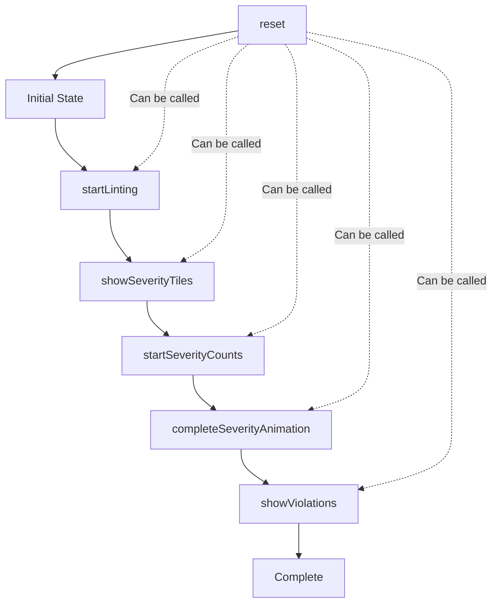

# Animation Store

The animation store manages complex, multi-phase animation sequences throughout the linting process using Zustand for state management.

## Overview

The animation store orchestrates the entire linting animation sequence, from initial state through completion. It ensures animations happen in the correct order with proper timing and prevents conflicts between different animation phases.

## State Structure

```typescript
interface AnimationState {
  // Animation phases
  isLinting: boolean; // Initial linting state
  severityTilesVisible: boolean; // Severity tiles are visible
  severityCountsAnimating: boolean; // Count animations are running
  severityAnimationComplete: boolean; // All severity animations done
  violationsVisible: boolean; // Violations are visible

  // Actions
  reset: () => void; // Reset to initial state
  startLinting: () => void; // Begin linting sequence
  showSeverityTiles: () => void; // Show severity tiles
  startSeverityCounts: () => void; // Start count animations
  completeSeverityAnimation: () => void; // Mark severity complete
  showViolations: () => void; // Show violations
}
```

## Animation Sequence

### **Phase 1: Linting Start**

```typescript
startLinting() → {
  isLinting: true,
  severityTilesVisible: false,
  severityCountsAnimating: false,
  severityAnimationComplete: false,
  violationsVisible: false
}
```

**Duration**: Immediate state change
**Purpose**: Prepare UI for linting process

### **Phase 2: Severity Tiles Reveal**

```typescript
showSeverityTiles() → {
  severityTilesVisible: true,
  isLinting: false
}
```

**Duration**: 500ms with `ease-gentle` timing
**Animation**: Tiles slide up from below with opacity transition
**Purpose**: Display severity breakdown tiles

### **Phase 3: Count Animations**

```typescript
startSeverityCounts() → {
  severityCountsAnimating: true
}
```

**Duration**: 800ms with staggered delays (0ms, 150ms, 300ms)
**Animation**: Count-up effect with `ease-gentle` timing
**Purpose**: Animate severity counts from 0 to final values

### **Phase 4: Severity Complete**

```typescript
completeSeverityAnimation() → {
  severityAnimationComplete: true,
  severityCountsAnimating: false
}
```

**Duration**: Immediate state change
**Purpose**: Signal completion of severity phase

### **Phase 5: Violations Reveal**

```typescript
showViolations() → {
  violationsVisible: true
}
```

**Duration**: 700ms with `ease-spring` timing
**Animation**: Violations slide up with staggered delays (80ms per item)
**Purpose**: Display violation details

## Usage in Components

### **SeverityFilter Component**

```tsx
const {
  severityTilesVisible,
  severityCountsAnimating,
  completeSeverityAnimation,
  showViolations,
} = useAnimationStore();

// Handle count animation completion
const handleCountAnimationComplete = () => {
  countAnimationCompleteRef.current += 1;
  if (countAnimationCompleteRef.current >= targetAnimationCountRef.current) {
    completeSeverityAnimation();
    // Trigger violations animation
    requestAnimationFrame(() => {
      showViolations();
    });
  }
};
```

### **ViolationsSection Component**

```tsx
const { violationsVisible } = useAnimationStore();

// Apply animation with stagger
<div
  className={cn(
    "transition-all duration-700 ease-spring",
    violationsVisible ? "opacity-100 translate-y-0" : "opacity-0 translate-y-2"
  )}
  style={{ transitionDelay: `${animationDelay}ms` }}
>
  {/* Violation items with staggered animation */}
</div>;
```

## Timing Coordination

### **Stagger Delays**

- **Severity tiles**: 0ms (all appear simultaneously)
- **Count animations**: 0ms, 150ms, 300ms (sequential counting)
- **Violation items**: 80ms per item (cascading reveal)

### **Animation Durations**

- **Severity tiles**: 500ms (`ease-gentle`)
- **Count animations**: 800ms (`ease-gentle`)
- **Violations**: 700ms (`ease-spring`)

### **Total Sequence Time**

- **Minimum**: ~1.5 seconds
- **Typical**: 2-3 seconds (depending on violation count)
- **Maximum**: No hard limit (scales with content)

## State Transitions



## Error Handling

### **Animation Interruption**

- Store can be reset at any time
- State transitions are atomic
- No partial animation states

### **Component Cleanup**

- Components should unsubscribe from store changes
- Animation state persists until explicitly reset
- No automatic cleanup on component unmount

## Performance Considerations

### **State Updates**

- Zustand batches updates efficiently
- Minimal re-renders during animation sequences
- DevTools integration for debugging

### **Animation Timing**

- Uses `requestAnimationFrame` for smooth 60fps
- CSS transitions for hardware acceleration
- JavaScript animations only when necessary

## Best Practices

### **DO**

- Use the store for coordinating multi-phase animations
- Respect the animation sequence order
- Implement proper completion callbacks
- Use consistent timing and easing

### **DON'T**

- Modify animation state outside the store
- Skip animation phases
- Use arbitrary timing values
- Block the main thread during animations

## Debugging

### **DevTools Integration**

```typescript
// Store includes devtools middleware
{
  name: "animation-store",
  serialize: { options: true }
}
```

### **State Inspection**

```typescript
// Check current animation state
const state = useAnimationStore.getState();
console.log("Animation state:", state);
```

### **Common Issues**

- **Animations not starting**: Check if `startLinting()` was called
- **Counts not animating**: Verify `severityCountsAnimating` is true
- **Violations not showing**: Ensure `severityAnimationComplete` is true

## Future Enhancements

### **Planned Features**

- `prefers-reduced-motion` support
- Animation pause/resume functionality
- Custom animation timing configuration
- Animation performance metrics

### **Accessibility Improvements**

- Respect user motion preferences
- Provide animation alternatives
- Screen reader announcements for state changes

This store provides a robust foundation for complex animation sequences while maintaining performance and accessibility standards.
